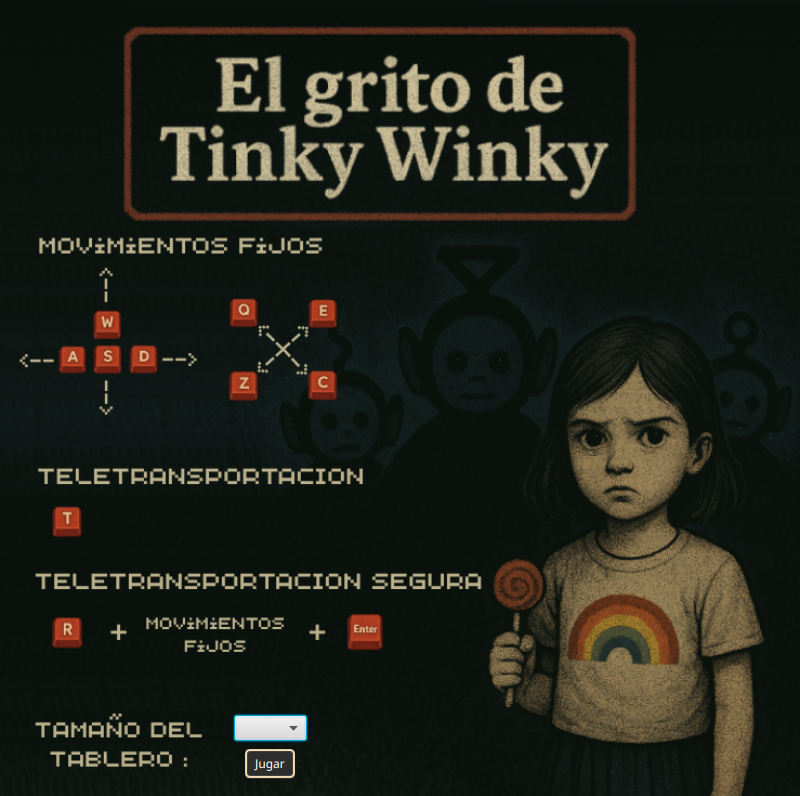
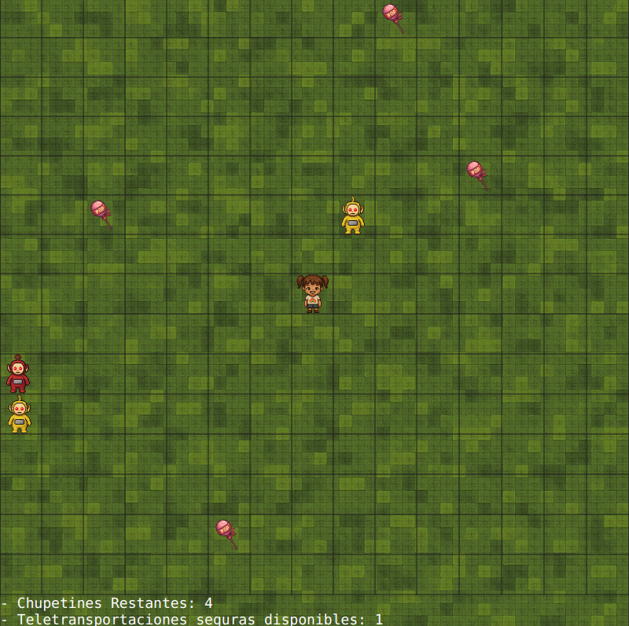

## TP1: Robots

### Objetivo

Implementar el videojuego **Robots**, una variante del clásico juego Chase, aplicando conceptos de **programación orientada a objetos** e **interfaces gráficas**.

---

### Descripción del Juego

- **Robots** es un juego por turnos donde el jugador debe escapar de robots que lo persiguen.
- El juego termina si el jugador es alcanzado por un robot o pisa una celda incendiada.
- El juego consta de niveles infinitos con dificultad incremental.
- Cada nivel se juega en una **grilla bidimensional** de tamaño configurable (N filas x M columnas).
- El jugador comienza en el centro de la grilla.
- En cada nivel hay robots ubicados en posiciones aleatorias.
- El jugador dispone de **teletransportaciones seguras** limitadas, ganando una extra al iniciar cada nivel.

---

### Reglas del Juego

#### Turno del Jugador

- Puede moverse a una celda vecina (8 direcciones: horizontal, vertical y diagonal).
- Puede teletransportarse a una celda aleatoria (puede estar ocupada).
- Si tiene usos disponibles, puede teletransportarse a una celda a elección (**teletransportación segura**).

#### Turno de los Robots

- Hay dos tipos de robots:
  - **1x:** se mueve una celda por turno hacia el jugador.
  - **2x:** se mueve dos celdas por turno hacia el jugador.
- Si un robot llega a la celda del jugador, el juego termina.

#### Colisiones y Celdas Especiales

- Si dos o más robots terminan en la misma celda, se destruyen y la celda queda **incendiada** hasta el final del nivel.
- Si el jugador pisa una celda incendiada, pierde.
- Si un robot pisa una celda incendiada, es destruido.

#### Recursos Recolectables

- Hay **4 recursos** (ej: diamantes) por nivel, ubicados en celdas aleatorias y separadas al menos 3 celdas entre sí.
- Los recursos **no son transitables para robots**, pero sí para el jugador.
- Al recolectar un recurso, desaparece y la celda pasa a ser transitable para robots.
- Si el jugador recolecta todos los recursos o destruye todos los robots, pasa al siguiente nivel.

---

### Interfaz Gráfica

- Implementar la interfaz con **JavaFX**.
- Debe ser posible jugar con **mouse** o **teclado**.
- Se pueden usar imágenes propias o las provistas.
- Permitir configurar el tamaño de la grilla.
- Mostrar la cantidad de recursos pendientes en el nivel actual.
- Al perder, debe poder reiniciarse la partida.

---

### Requerimientos Técnicos

- El proyecto debe utilizar **Maven**.
- Separar claramente la **lógica** y la **interfaz gráfica** en dos capas de abstracción.
- Utilizar **polimorfismo** para los comportamientos de robots y celdas incendiadas.
- Incluir un **diagrama de clases y/o secuencia** (PNG o PDF) con las clases principales de la capa lógica.

---

## Interfaz

### Pantalla de inicio

### Juego
